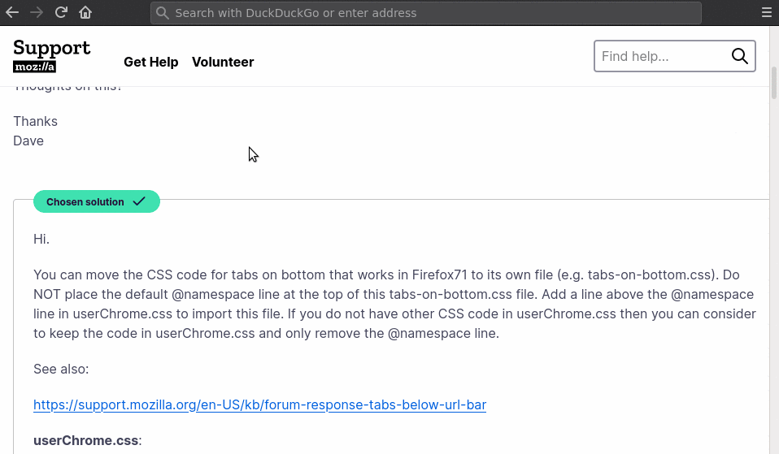

# firefox-slidedown-tabs

The CSS files in this repo enable you to configure Firefox so that tabs
slide down from the navigation bar on hover or on focus, and hide
otherwise. This saves vertical space when using Firefox.



## Installation

You should ensure that you have custom styling enabled in
Firefox.

Afterward, copy the files from this repo in the `chrome` folder
of your `profile` folder (as found in `about:support`).

If you want to clone and track the Git repo directly, I recommend
cloning the repo into a subdirectory of `chrome`. Then, you can create
a blank `userChrome.css` in the `chrome` folder and
he single line:

```css
    @import(firefox-slidedown-tabs/userChrome.css)
```

This allows you to combine `firefox-slidedown-tabs` with other
customizations in your base `userChrome.css`.

If you want to place the Git repo folder elsewhere on your computer,
a good idea is to place a symbolic link to it within the `chrome`
folder.

### Enabling Custom Styling in Firefox

First go to `about:config` in Firefox and set
`toolkit.legacyUserProfileCustomizations.stylesheets` to `true`.

Second, go to `about:support` in Firefox, find `Profile Directory`,
and click `Open Directory`. This will bring you to the `profile`
folder discussed above.

## Tweaking the Code Yourself / Contributing

Several of the color values and sizes are currently hard-coded
for my Firefox setup (Firefox 78, Compact Toolbar, Mozilla Dark theme).
I might experiment with some other themes to make the slidedown tabs
more robust.

If you have suggestions on how to make the code more general,
I am open to pull requests and contributors.

## Known Issues

### Lack of Automatic Theme Adaptability

As noted above, currently color values and sizes must be manually
tweaked for your theme.

### No Reordering Tabs

Using drag-and-drop to swap around the order of tabs currently does not
work without introducing an ugly black bar that defeats the purpose of
saving space. (The rule that creates this black bar is commented out by
default). For now, I recommend installing a Firefox Extension that can
help you move tabs by keyboard shortcut, if you desire to move your
tabs.

Dragging tabs between Firefox windows, or out of the window to create
a new window, does work.

### Adding Menu Bar or Bookmarks Toolbar Breaks Code

Because I don't use typically  menu bar or bookmarks toolbar, I did not
initially notice that these break the position of the slidedown tabs.
I will investigate and attempt a fix.

## Acknowledgments

Much of the initial code is based two answers by
[cor-el](https://support.mozilla.org/en-US/user/cor-el) in the Firefox
Support Forums. Links to the relevant answers are provided in code.
